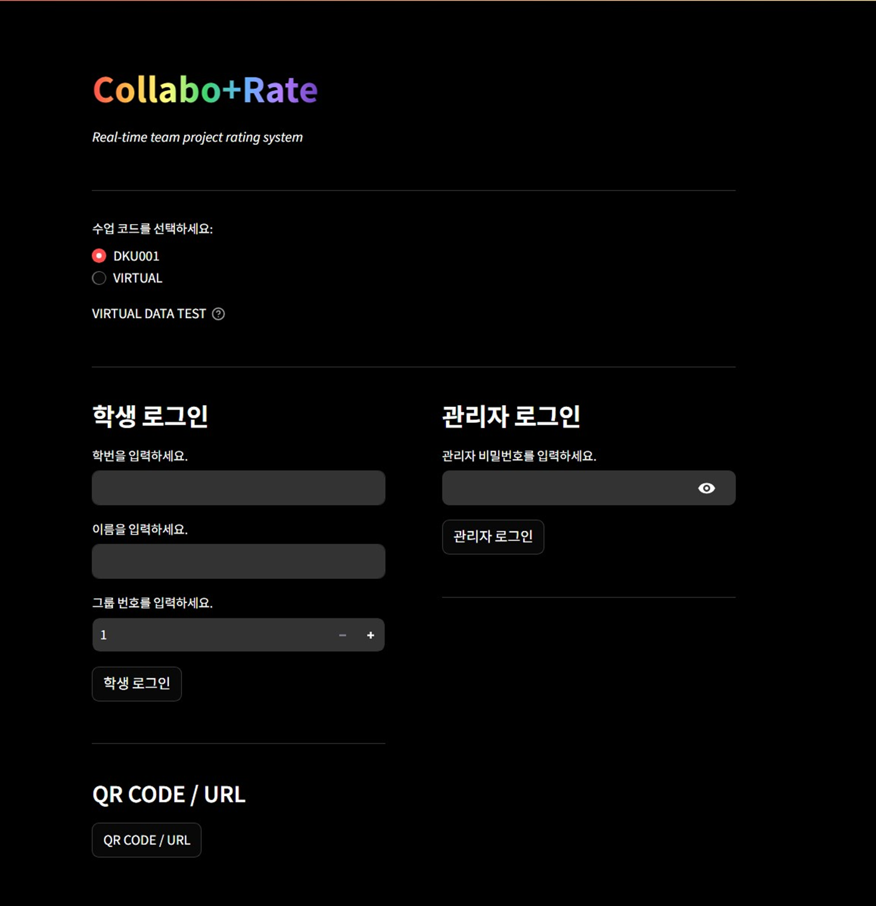
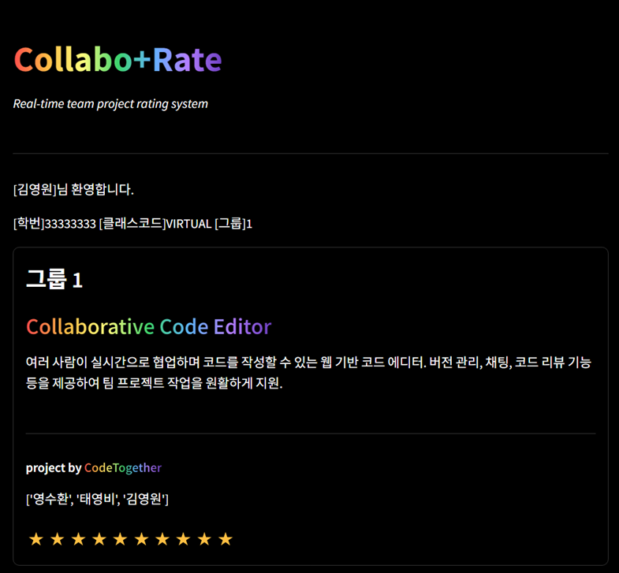
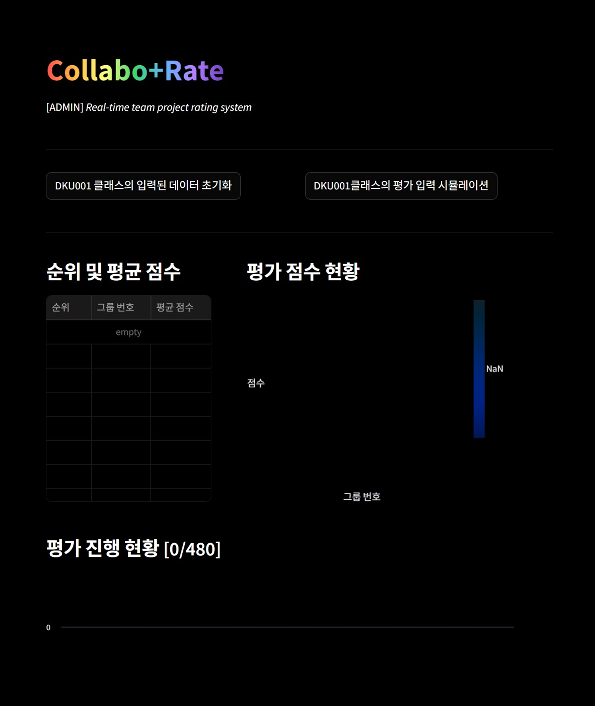
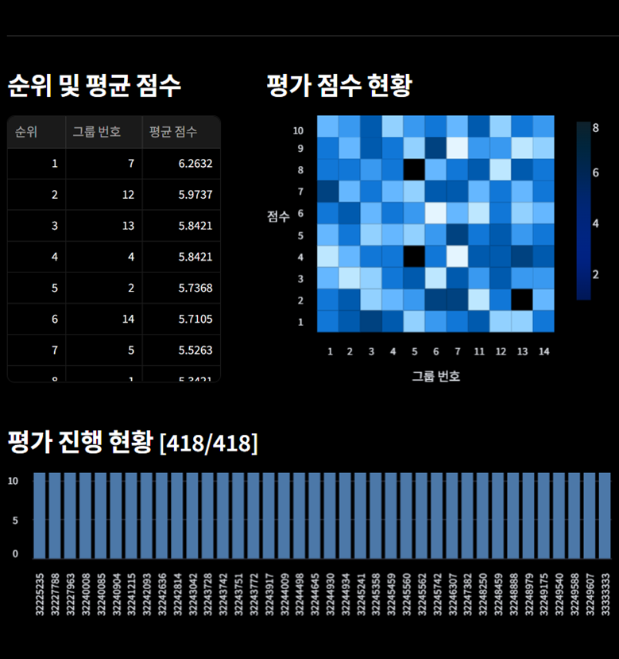
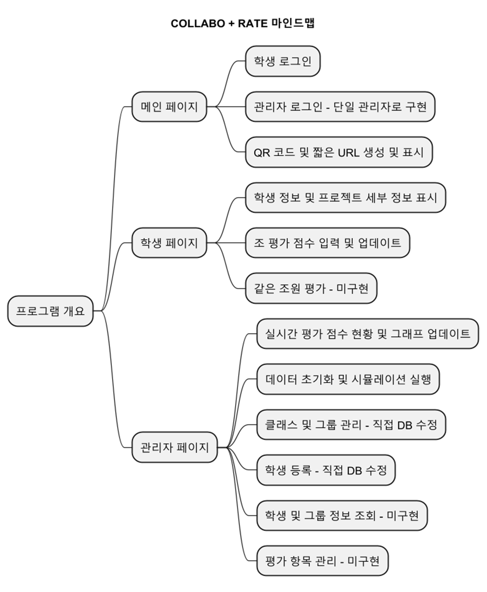
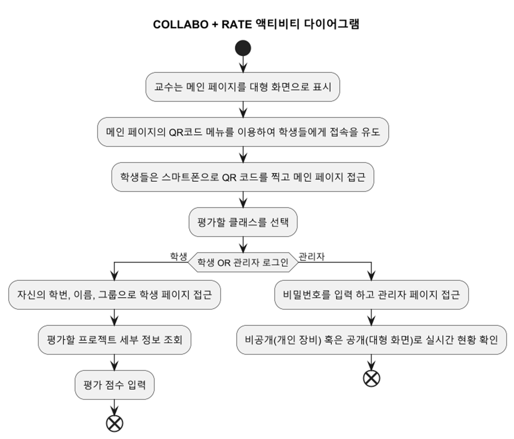

# Collabo+Rate
> __Collabo+Rate는 투명하고 원활한 팀 프로젝트 평가를 위한 솔루션입니다.__
> 2024.11 ~ 2024.12
- - -
### 개발 계기
초등학생 때부터 대학생이 된 지금까지, 많은 팀별 활동을 진행해왔다. 팀 프로젝트를 진행할 때마다, 매번 비슷한 문항과 양식을 작성해야 하는 팀 프로젝트 평가 과정은 불편했고, 비효율적으로 느껴졌다. 

이러한 문제를 해결하고자, 팀플레이 평가 솔루션 Collabo+Rate를 개발하게 되었다.

### Tech Stack

### 화면 구성
#### Main Page

#### Student Page

#### Admin Page
- 평가 전

- 평가 후

### Diagrams
#### Functional Diagram

#### Activity Diagram

### DevLog
[Collabo+Rate_DevLog](docs/dev_log.md)
